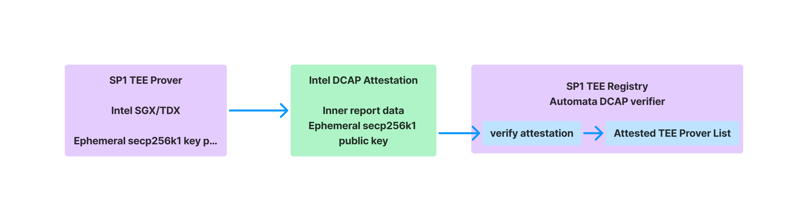

<div align="center">
  <picture>
    <source media="(prefers-color-scheme: dark)" srcset="https://raw.githubusercontent.com/automata-network/automata-brand-kit/main/PNG/ATA_White%20Text%20with%20Color%20Logo.png">
    <source media="(prefers-color-scheme: light)" srcset="https://raw.githubusercontent.com/automata-network/automata-brand-kit/main/PNG/ATA_Black%20Text%20with%20Color%20Logo.png">
    
  </picture>
</div>

# SP1 TEE Prover
[](https://github.com/automata-network)

## About

Zero-knowledge proofs (ZKPs) are one of the most critical technologies for blockchain scaling, interoperability and privacy.

[SP1](https://github.com/succinctlabs/sp1) provides a performant, general-purpose zkVM that enables any developer to use ZKPs by writing normal code (in Rust), and get cheap and fast proofs. Developers can write programs in Rust or any LLVM-compiled language, compile them to RISC-V executables, and use the `sp1-sdk` crate to generate proofs with their ELF files and input data. The `sp1-sdk` can generate proofs locally or utilize Succinct's prover network for proof generation.

Integrating a TEE prover into Succinct's prover network enhances security, privacy, and trust by enabling tamper-resistant and confidential proof generation through hardware-backed guarantees. It enables sensitive computations to remain private, provides attestation for verifying the integrity of the proving environment, and ensures compliance with regulatory standards.

This repository introduces a PoC for a multi-proved verification of SP1's execution process via Intel TDX. Given a guest program (ELF) and a test case input (stdin), users can generate the corresponding TEE Proof via the TEE Prover.

## Prerequisite

* [Rust](https://doc.rust-lang.org/cargo/getting-started/installation.html)
* [SP1](https://docs.succinct.xyz/getting-started/install.html)
* [Docker](https://docs.docker.com/get-started/get-docker/)

### Hardware Requirements

The following cloud service providers (CSP) have support for Intel TDX:

#### GCP

- Instance Type: c3-standard-* family
- Operating System: containerOS, RHEL0, SLES-15-sp5, Ubuntu 22.04
- Supported Zones: asia-southeast-1-{a,b,c}, europe-west4-{a,b}, us-central1-{a,b,c} 
- For more information on supported operating systems, please check out the following article on GCP: [supported configurations](https://cloud.google.com/confidential-computing/confidential-vm/docs/supported-configurations#intel-tdx)
- Currently, TDX enabled VMs can only be created via gcloud or REST API, please refer to this article on how to do so: [create an instance](https://cloud.google.com/confidential-computing/confidential-vm/docs/create-a-confidential-vm-instance#gcloud)

#### Azure

- Instance Type: DCesv5-series, DCedsv5-series, ECesv5-series, ECedsv5-series
- Operating System:  Ubuntu 24.04 Server (Confidential VM)- x64 Gen 2 image, Ubuntu 22.04 Server (Confidential VM) - x64 Gen 2 image.
- Supported Region: West Europe, Central US, East US 2, North Europe

#### Others

- If you wish to use a CSP that is not listed above or run your own host, please ensure that the CSP or host is running the following specs:
  - Linux Kernel >= 6.7
  - Virtual Machine (VM) runs under KVM hypervisor 
  - VM has access to `/sys/kernel/config/tsm/report` and able to create a temporary directory with sudo (eg. `sudo mkdir /sys/kernel/config/tsm/report/testing123`).
> If you receive the error `mkdir: cannot create directory ‘testing123’: No such device or address`, it means that ConfigFS is not supported on your VM.

## Architecture


For each TEE Prover:

1. Upon receiving a request, it performs the SP1 client setup and executes computations within the TEE environment to generate the corresponding verification key (VK) and public values.

2. It signs the computation results using its internal active ephemeral secp256k1 key and packages them into a TEE proof for on-chain verification.

After receiving the TEE proof, the client can call an on-chain verification contract to validate its legitimacy (by accessing the registry contract) and correctness (by verifying its secp256k1 signature using the ecrecover method).

### TEE Prover Registration and Key Rotation


- The SP1 TEE Prover operates in an Intel TDX environment and periodically generates ephemeral secp256k1 key pair for subsequent signature verification.
- The SP1 TEE Prover uses Intel DCAP Quotes for registration and updating its on-chain state. The Quote's report data includes the current ephemeral secp256k1 public key.
- The SP1 TEE Prover must periodically update its on-chain state. Within the SP1 TEE Registry smart contract, it utilizes the [Automata DCAP verifier](https://github.com/automata-network/automata-dcap-attestation) to validate the Intel DCAP Quote, extract the report data, and store the corresponding public key with an expiration time.

## Getting Started

### TEE Prover

Once you have completed setting up the Intel TDX CVM environment, you can quickly compile and launch a TEE Prover.

```bash
$ sudo apt install build-essential pkg-config libtss2-dev libssl-dev
$ git clone https://github.com/automata-network/sp1-tee-prover.git
$ cd sp1-tee-prover
$ cargo build --release
$ sudo ./target/release/sp1-tee-prover --key <PrivateKey>
```

The `Key` parameter is an EOA account responsible for sending transactions within the TEE Prover to complete TEE identity registration and key rotation which occurs every 30 minutes.

### Request client

Using the existing Fibonacci example in SP1, we can easily set up an HTTP client to send requests to the TEE Prover. This primarily includes the request proof and wait proof interfaces, which are consistent with the interfaces currently exposed by the SP1 client. Check the example at [fibonacci-script](https://github.com/automata-network/sp1/blob/tee-prover-sample/examples/fibonacci/script/bin/execute.rs).

Similar with the current NetworkProver interfaces, you can call async functions directly and have programmatic access to the proof ID and download proofs by ID.

```rust
pub enum ProofMode {
    /// Unspecified or invalid proof mode.
    #[default] Unspecified = 0,
    /// The proof mode for an SP1 core proof.
    Core = 1,
    /// The proof mode for a compressed proof.
    Compressed = 2,
    /// The proof mode for a PlonK proof.
    Plonk = 3,
    /// The proof mode for a Groth16 proof.
    Groth16 = 4,
    /// The proof mode for a TEE proof
    TEE = 5,
}

pub struct TEEProof {
    pub signature: Vec<u8>,
    pub vk: Vec<u8>,
    pub public_values: Vec<u8>,
}

/// Requests a proof from the TEE prover, returning the TEE proof ID.
pub async fn request_proof(
    elf: &[u8],
    stdin: SP1Stdin,
    mode: ProofMode,
) -> Result<String>;

/// Waits for a TEE proof to be generated and returns the TEE proof.
pub async fn wait_proof(
    proof_id: &str,
) -> Result<TEEProof>;
```

The TEE Prover concatenates the bytes of the verifying key and the public values obtained from execution, and then signs the concatenated bytes using its ephemeral key.

### Smart contracts

The smart contracts consist of two main components:

1. [TEE Registry](https://explorer-testnet.ata.network/address/0xb110688B9F1b6a88bDAf51e0E9Be6A9243b52C94): This contract is primarily used for the registration and management of TEE identities. For TEE Provers that pass Intel DCAP Quote verification, the smart contract stores the corresponding account and registration timestamp in its storage. Each Prover must rotate their key within the specified time; otherwise, subsequent submitted signatures will not be recognized as coming from an attested TEE Prover.

    To prevent a TEE Prover from pre-generating a large number of legitimate signer accounts and Intel DCAP Quotes before exiting the TEE environment, we require that the `report data` in each Intel DCAP Quote includes not only the new signer account but also information about the current block. Only Quotes generated within a specified number of recent blocks are considered valid for registration or key rotation. The default parameters for the contract are

    ```
    attestValiditySeconds = 3600
    maxBlockNumberDiff = 100
    ```

2. [MultiProof](https://explorer-testnet.ata.network/address/0xF42B05B7CAf5b0CE2441D73E1c3982D8f51f28aF): This contract demonstrates the overall workflow. It performs a simple ecrecover verification on the signatures generated by the TEE Prover based on the computation results, the verification key and the public values coming from the SP1 client. Additionally, it checks the TEE Registry to verify whether the signer is a valid attested TEE Prover at the current time.

    When you run the TEE Prover and successfully process a request, you can quickly find the parameters for the verifyTEEProof call in the logs.

    ```bash
    [2024-12-27T07:56:12.892Z INFO  sp1_tee_prover] Key pair updated, new evm account: 0x24f467036294dacac4d86ba2ed17323514fb1616
    [2024-12-27T07:56:38.611Z INFO  sp1_tee_prover] sha256(message): "a50f6fca342d194a8443e9e8299cc6c0338bde0943ddc8efcd2d0c126a764a6b"
    [2024-12-27T07:56:38.612Z INFO  sp1_tee_prover] signature: "22e32fe8df3cf338a4d60578b51972d0e56e2e6114da843c4af1301524dbfaee0f8c4e8193db093c718a646f33cd39dee94829db1aab019541875e5ad25501ea1c"
    ```

Both contracts are deployed to Automata Testnet:

| Contract | Address |
| --- | --- |
| TEE Registry | [0xb110688B9F1b6a88bDAf51e0E9Be6A9243b52C94](https://explorer-testnet.ata.network/address/0xb110688B9F1b6a88bDAf51e0E9Be6A9243b52C94) |
| MultiProof | [0xF42B05B7CAf5b0CE2441D73E1c3982D8f51f28aF](https://explorer-testnet.ata.network/address/0xF42B05B7CAf5b0CE2441D73E1c3982D8f51f28aF) |

## Contributing
**Before You Contribute**:
* **Raise an Issue**: If you find a bug or wish to suggest a feature, please open an issue first to discuss it. Detail the bug or feature so we understand your intention.  
* **Pull Requests (PR)**: Before submitting a PR, ensure that:  
    * Your contribution successfully builds.
    * It includes tests, if applicable.

## License
Apache License